# 📊 PHÂN TÍCH LOGIC XỬ LÝ BATCH FILE EXCEL

## 📋 Mục lục

- [1. Tổng quan](#1-tổng-quan)
- [2. Flow Tổng quan](#2-flow-tổng-quan)
- [3. Sequence Diagram Chi tiết](#3-sequence-diagram-chi-tiết)
- [4. State Transition Diagram](#4-state-transition-diagram)
- [5. Frontend Logic](#5-frontend-logic)
- [6. Backend Logic](#6-backend-logic)
- [7. Data Processing Logic](#7-data-processing-logic)
- [8. Stored Procedures Deep Dive](#8-stored-procedures-deep-dive)
- [9. Database Schema](#9-database-schema)
- [10. Validation Layers](#10-validation-layers)
- [11. Error Scenarios](#11-error-scenarios)
- [12. Performance & Monitoring](#12-performance--monitoring)
- [13. Best Practices](#13-best-practices)
- [14. Testing Strategy](#14-testing-strategy)
- [15. Future Enhancements](#15-future-enhancements)

---

## 1. Tổng quan

Document này phân tích chi tiết và toàn diện luồng xử lý batch file Excel từ Frontend (React) đến Backend (FastAPI), bao gồm:

- ✅ **Upload Flow**: Multi-file upload với validation
- ✅ **Processing Pipeline**: Phân loại, extract, transform data theo loại file (MN/MB/MT)
- ✅ **Data Cleaning**: Stored procedures để clean, enrich, validate
- ✅ **Error Handling**: Multi-layer error detection và reporting
- ✅ **State Management**: Tracking data flow qua các tables
- ✅ **Monitoring**: Real-time statistics và progress tracking

### Kiến trúc tổng thể

```
┌─────────────────┐
│   Frontend      │  React + TypeScript
│   (Browser)     │  - File upload UI
│                 │  - Progress tracking
│                 │  - Result display
└────────┬────────┘
         │ HTTP/HTTPS (FormData)
         │
┌────────▼────────┐
│   Backend API   │  FastAPI + SQLAlchemy
│   (/upload)     │  - File validation
│                 │  - Temp storage
│                 │  - Excel processing
└────────┬────────┘
         │
┌────────▼────────┐
│  Excel Batch    │  Pandas + Custom Logic
│  Processor      │  - MN/MB/MT detection
│                 │  - Column mapping
│                 │  - Data extraction
└────────┬────────┘
         │
┌────────▼────────┐
│   Database      │  SQL Server
│   (Raw Tables)  │  - flight_raw
│                 │  - import_log
└────────┬────────┘
         │
┌────────▼────────┐
│  Stored Procs   │  T-SQL
│  (Cleaning)     │  - usp_CleanAndProcessFlightData
│                 │  - usp_CleanAndValidateFlightData
└────────┬────────┘
         │
┌────────▼────────┐
│   Database      │  SQL Server
│  (Final Tables) │  - flight_data_chot
│                 │  - error_table
│                 │  - Missing_Dimensions_Log
└─────────────────┘
```

---

## 2. Flow Tổng quan

### 2.1. High-Level Flow

```mermaid
graph TD
    A[👤 User Upload Files] --> B[📤 Frontend: Tạo FormData]
    B --> C[🌐 POST /upload-files API]
    C --> D[💾 Backend: Lưu vào Temp Directory]
    D --> E[🔄 Loop qua từng file]
    E --> F{📋 File đã import?}
    F -->|Yes| G[⏭️ Skip file + counter++]
    F -->|No| H[🔍 Xác định loại file MN/MB/MT]
    H --> I{✅ Loại file valid?}
    I -->|No| Z1[❌ Add error, continue]
    I -->|Yes| J[📖 Đọc & parse Excel]
    J --> K[🔧 Process theo loại file]
    K --> L{📊 Data valid?}
    L -->|No| Z2[❌ Add error, continue]
    L -->|Yes| M[💾 Lưu vào flight_raw]
    M --> N[📝 Ghi log import_log]
    N --> O[✅ Update counters]
    O --> P{🔁 Còn file?}
    P -->|Yes| E
    P -->|No| Q[💾 Commit raw data]
    Q --> R[🧹 Run SP: CleanAndProcess]
    R --> S[✔️ Run SP: Validate]
    S --> T[📊 Get Processing Summary]
    T --> U[📤 Return JSON Response]
    U --> V[🖥️ Frontend: Parse & Display]
    V --> W[🎉 Show Toast Notifications]
    W --> X[📊 Render Statistics]
```



### 2.2. Swimlane Diagram - Actor Interactions

```
┌─────────────┬──────────────────┬──────────────────┬────────────────┬──────────────┐
│    USER     │    FRONTEND      │    BACKEND API   │   PROCESSOR    │   DATABASE   │
├─────────────┼──────────────────┼──────────────────┼────────────────┼──────────────┤
│             │                  │                  │                │              │
│ Select Files│                  │                  │                │              │
│────────────>│                  │                  │                │              │
│             │                  │                  │                │              │
│             │ Validate Files   │                  │                │              │
│             │ (client-side)    │                  │                │              │
│             │─────────┐        │                  │                │              │
│             │         │        │                  │                │              │
│             │<────────┘        │                  │                │              │
│             │                  │                  │                │              │
│             │ Create FormData  │                  │                │              │
│             │─────────┐        │                  │                │              │
│             │         │        │                  │                │              │
│             │<────────┘        │                  │                │              │
│             │                  │                  │                │              │
│             │ POST /upload     │                  │                │              │
│             │─────────────────>│                  │                │              │
│             │                  │                  │                │              │
│             │                  │ Save to Temp     │                │              │
│             │                  │─────────┐        │                │              │
│             │                  │         │        │                │              │
│             │                  │<────────┘        │                │              │
│             │                  │                  │                │              │
│             │                  │ Check Duplicate  │                │              │
│             │                  │─────────────────>│                │              │
│             │                  │                  │                │              │
│             │                  │                  │ Query import   │              │
│             │                  │                  │───────────────>│              │
│             │                  │                  │                │              │
│             │                  │                  │ Return result  │              │
│             │                  │                  │<───────────────│              │
│             │                  │                  │                │              │
│             │                  │ Result           │                │              │
│             │                  │<─────────────────│                │              │
│             │                  │                  │                │              │
│             │                  │ Process Excel    │                │              │
│             │                  │─────────────────>│                │              │
│             │                  │                  │                │              │
│             │                  │                  │ Read Excel     │              │
│             │                  │                  │ Parse Sheets   │              │
│             │                  │                  │ Map Columns    │              │
│             │                  │                  │ Clean Data     │              │
│             │                  │                  │                │              │
│             │                  │ DataFrame        │                │              │
│             │                  │<─────────────────│                │              │
│             │                  │                  │                │              │
│             │                  │ Save to DB       │                │              │
│             │                  │─────────────────────────────────>│              │
│             │                  │                  │                │              │
│             │                  │                  │                │ INSERT       │
│             │                  │                  │                │ flight_raw   │
│             │                  │                  │                │              │
│             │                  │ Commit           │                │              │
│             │                  │─────────────────────────────────>│              │
│             │                  │                  │                │              │
│             │                  │                  │                │ COMMIT       │
│             │                  │                  │                │              │
│             │                  │ Run SP: Clean    │                │              │
│             │                  │─────────────────────────────────>│              │
│             │                  │                  │                │              │
│             │                  │                  │                │ EXEC SP      │
│             │                  │                  │                │ Clean+Enrich │
│             │                  │                  │                │              │
│             │                  │ Run SP: Validate │                │              │
│             │                  │─────────────────────────────────>│              │
│             │                  │                  │                │              │
│             │                  │                  │                │ EXEC SP      │
│             │                  │                  │                │ Validate+Log │
│             │                  │                  │                │              │
│             │                  │ Get Summary      │                │              │
│             │                  │─────────────────────────────────>│              │
│             │                  │                  │                │              │
│             │                  │                  │                │ Query Stats  │
│             │                  │                  │                │              │
│             │                  │ Statistics       │                │              │
│             │                  │<─────────────────────────────────│              │
│             │                  │                  │                │              │
│             │ JSON Response    │                  │                │              │
│             │<─────────────────│                  │                │              │
│             │                  │                  │                │              │
│ Display     │ Parse + Render   │                  │                │              │
│ Results     │ Statistics       │                  │                │              │
│<────────────│                  │                  │                │              │
│             │                  │                  │                │              │
└─────────────┴──────────────────┴──────────────────┴────────────────┴──────────────┘
```

---

## 3. Sequence Diagram Chi tiết

### 3.1. File Upload & Processing Sequence

```
USER         FRONTEND          API ENDPOINT         PROCESSOR         DATABASE         STORED PROC
 │                │                    │                   │                │                 │
 │ Click Upload   │                    │                   │                │                 │
 │───────────────>│                    │                   │                │                 │
 │                │                    │                   │                │                 │
 │                │ Validate Extensions│                   │                │                 │
 │                │ (.xlsx, .xls)     │                   │                │                 │
 │                │───────┐            │                   │                │                 │
 │                │       │            │                   │                │                 │
 │                │<──────┘            │                   │                │                 │
 │                │                    │                   │                │                 │
 │                │ Create FormData()  │                   │                │                 │
 │                │───────┐            │                   │                │                 │
 │                │       │            │                   │                │                 │
 │                │<──────┘            │                   │                │                 │
 │                │                    │                   │                │                 │
 │                │ POST /upload-files │                   │                │                 │
 │                │ (multipart/form)   │                   │                │                 │
 │                │───────────────────>│                   │                │                 │
 │                │                    │                   │                │                 │
 │                │                    │ Create TempDir    │                │                 │
 │                │                    │──────────┐        │                │                 │
 │                │                    │          │        │                │                 │
 │                │                    │<─────────┘        │                │                 │
 │                │                    │                   │                │                 │
 │                │                    │ for file in files:│                │                 │
 │                │                    │──────────┐        │                │                 │
 │                │                    │          ↓        │                │                 │
 │                │                    │                   │                │                 │
 │                │                    │ await file.read() │                │                 │
 │                │                    │──────────┐        │                │                 │
 │                │                    │          │        │                │                 │
 │                │                    │<─────────┘        │                │                 │
 │                │                    │                   │                │                 │
 │                │                    │ write(temp_path)  │                │                 │
 │                │                    │──────────┐        │                │                 │
 │                │                    │          │        │                │                 │
 │                │                    │<─────────┘        │                │                 │
 │                │                    │                   │                │                 │
 │                │                    │ is_file_imported()│                │                 │
 │                │                    │──────────────────>│                │                 │
 │                │                    │                   │                │                 │
 │                │                    │                   │ SELECT FROM    │                 │
 │                │                    │                   │ import_log     │                 │
 │                │                    │                   │───────────────>│                 │
 │                │                    │                   │                │                 │
 │                │                    │                   │ Result (bool)  │                 │
 │                │                    │                   │<───────────────│                 │
 │                │                    │                   │                │                 │
 │                │                    │ bool (imported?)  │                │                 │
 │                │                    │<──────────────────│                │                 │
 │                │                    │                   │                │                 │
 │                │                    │ find_matching_key │                │                 │
 │                │                    │──────────────────>│                │                 │
 │                │                    │                   │                │                 │
 │                │                    │                   │ Match pattern  │                 │
 │                │                    │                   │ (MN/MB/MT)     │                 │
 │                │                    │                   │───────┐        │                 │
 │                │                    │                   │       │        │                 │
 │                │                    │                   │<──────┘        │                 │
 │                │                    │                   │                │                 │
 │                │                    │ file_type         │                │                 │
 │                │                    │<──────────────────│                │                 │
 │                │                    │                   │                │                 │
 │                │                    │ process_excel_file│                │                 │
 │                │                    │──────────────────>│                │                 │
 │                │                    │                   │                │                 │
 │                │                    │                   │ pd.read_excel()│                 │
 │                │                    │                   │───────┐        │                 │
 │                │                    │                   │       │        │                 │
 │                │                    │                   │<──────┘        │                 │
 │                │                    │                   │                │                 │
 │                │                    │                   │ if MN:         │                 │
 │                │                    │                   │  _process_mn() │                 │
 │                │                    │                   │ elif MB:       │                 │
 │                │                    │                   │  _process_mb() │                 │
 │                │                    │                   │ elif MT:       │                 │
 │                │                    │                   │  _process_mt() │                 │
 │                │                    │                   │───────┐        │                 │
 │                │                    │                   │       │        │                 │
 │                │                    │                   │<──────┘        │                 │
 │                │                    │                   │                │                 │
 │                │                    │ DataFrame         │                │                 │
 │                │                    │<──────────────────│                │                 │
 │                │                    │                   │                │                 │
 │                │                    │ _save_to_database │                │                 │
 │                │                    │──────────────────>│                │                 │
 │                │                    │                   │                │                 │
 │                │                    │                   │ for record:    │                 │
 │                │                    │                   │  db.add()      │                 │
 │                │                    │                   │───────────────>│                 │
 │                │                    │                   │                │                 │
 │                │                    │                   │                │ (staged)        │
 │                │                    │                   │                │                 │
 │                │                    │                   │ (no commit)    │                 │
 │                │                    │                   │<───────────────│                 │
 │                │                    │                   │                │                 │
 │                │                    │ mark_file_imported│                │                 │
 │                │                    │──────────────────>│                │                 │
 │                │                    │                   │                │                 │
 │                │                    │                   │ db.add(log)    │                 │
 │                │                    │                   │───────────────>│                 │
 │                │                    │                   │                │                 │
 │                │                    │                   │ (staged)       │                 │
 │                │                    │                   │<───────────────│                 │
 │                │                    │                   │                │                 │
 │                │                    │ results.append()  │                │                 │
 │                │                    │──────────┐        │                │                 │
 │                │                    │          │        │                │                 │
 │                │                    │<─────────┘        │                │                 │
 │                │                    │                   │                │                 │
 │                │                    │ db.commit()       │                │                 │
 │                │                    │──────────────────────────────────>│                 │
 │                │                    │                   │                │                 │
 │                │                    │                   │                │ COMMIT TRANS    │
 │                │                    │                   │                │ (flight_raw +   │
 │                │                    │                   │                │  import_log)    │
 │                │                    │                   │                │                 │
 │                │                    │ Success           │                │                 │
 │                │                    │<──────────────────────────────────│                 │
 │                │                    │                   │                │                 │
 │                │                    │ run_data_cleaning │                │                 │
 │                │                    │ _stored_procedure │                │                 │
 │                │                    │──────────────────────────────────────────────────────>│
 │                │                    │                   │                │                 │
 │                │                    │                   │                │ EXEC usp_Clean  │
 │                │                    │                   │                │ AndProcessFlight│
 │                │                    │                   │                │ Data            │
 │                │                    │                   │                │────────┐        │
 │                │                    │                   │                │        │        │
 │                │                    │                   │                │<───────┘        │
 │                │                    │                   │                │                 │
 │                │                    │ Success           │                │                 │
 │                │                    │<──────────────────────────────────────────────────────│
 │                │                    │                   │                │                 │
 │                │                    │ EXEC usp_Clean    │                │                 │
 │                │                    │ AndValidateFlight │                │                 │
 │                │                    │ Data              │                │                 │
 │                │                    │──────────────────────────────────────────────────────>│
 │                │                    │                   │                │                 │
 │                │                    │                   │                │ EXEC SP         │
 │                │                    │                   │                │────────┐        │
 │                │                    │                   │                │        │        │
 │                │                    │                   │                │<───────┘        │
 │                │                    │                   │                │                 │
 │                │                    │ Success           │                │                 │
 │                │                    │<──────────────────────────────────────────────────────│
 │                │                    │                   │                │                 │
 │                │                    │ get_processing    │                │                 │
 │                │                    │ _summary()        │                │                 │
 │                │                    │──────────────────>│                │                 │
 │                │                    │                   │                │                 │
 │                │                    │                   │ SELECT COUNT() │                 │
 │                │                    │                   │ FROM tables    │                 │
 │                │                    │                   │───────────────>│                 │
 │                │                    │                   │                │                 │
 │                │                    │                   │ Statistics     │                 │
 │                │                    │                   │<───────────────│                 │
 │                │                    │                   │                │                 │
 │                │                    │ summary_dict      │                │                 │
 │                │                    │<──────────────────│                │                 │
 │                │                    │                   │                │                 │
 │                │ JSON Response      │                   │                │                 │
 │                │<───────────────────│                   │                │                 │
 │                │                    │                   │                │                 │
 │                │ Parse & Render    │                   │                │                 │
 │                │───────┐            │                   │                │                 │
 │                │       │            │                   │                │                 │
 │                │<──────┘            │                   │                │                 │
 │                │                    │                   │                │                 │
 │ View Results   │                    │                   │                │                 │
 │<───────────────│                    │                   │                │                 │
 │                │                    │                   │                │                 │
```

### 3.2. Key Timing Points

| Phase | Component | Action | Avg Time | Notes |
|-------|-----------|--------|----------|-------|
| 1 | Frontend | File Selection | < 1s | User interaction |
| 2 | Frontend | Validation (client) | < 100ms | Size, extension checks |
| 3 | Network | Upload Transfer | varies | Depends on file size & network |
| 4 | Backend | Save to Temp | ~100ms/file | Disk I/O |
| 5 | Backend | Duplicate Check | ~50ms/file | DB query (indexed) |
| 6 | Processor | Excel Parsing | ~500ms-2s/file | Depends on rows |
| 7 | Processor | Data Transformation | ~200ms-1s | Pandas operations |
| 8 | Database | Bulk Insert Raw | ~500ms | Single transaction |
| 9 | Database | SP: CleanAndProcess | ~2-5s | Complex transformations |
| 10 | Database | SP: Validate | ~1-3s | Validation logic |
| 11 | Database | Get Summary | ~200ms | Aggregate queries |
| 12 | Network | Response Transfer | ~100ms | JSON serialization |
| 13 | Frontend | Render Results | ~100ms | React re-render |

**Total Time Estimate**: ~5-15 seconds for 2-5 files with ~5000-10000 rows each

---

## 4. State Transition Diagram

### 4.1. Data State Flow Through Tables

```
┌──────────────────────────────────────────────────────────────────────┐
│                          DATA LIFECYCLE                              │
└──────────────────────────────────────────────────────────────────────┘

   [Excel File]
        │
        ↓ (uploaded)
   ┌─────────────┐
   │  TEMP DIR   │  State: Temporary
   │             │  - File physically stored
   └──────┬──────┘  - Not yet in database
          │
          ↓ (parse & extract)
   ┌─────────────┐
   │   MEMORY    │  State: In-Memory DataFrame
   │ (DataFrame) │  - Pandas object
   └──────┬──────┘  - Column mapped
          │         - Data cleaned
          ↓ (bulk insert)
   ┌──────────────────────────────────────────┐
   │         flight_raw TABLE                 │  State: RAW
   ├──────────────────────────────────────────┤
   │ • All fields as strings                  │  - Unvalidated
   │ • No transformations                     │  - No enrichment
   │ • Source file tracked                    │  - Complete audit trail
   │ • Import timestamp                       │
   └──────┬───────────────────────────────────┘
          │
          ↓ (usp_CleanAndProcessFlightData)
   ┌──────────────────────────────────────────┐
   │    flight_clean_data_stg TABLE           │  State: STAGING
   ├──────────────────────────────────────────┤
   │ • Cleaned data                           │  - Trimmed, uppercase
   │ • Enriched with dimensions               │  - Joined with Route
   │ • Validation flags set                   │  - Joined with actype_seat
   │ • Error reasons calculated               │  - Ready for validation
   └──────┬───────────────────────────────────┘
          │
          ↓ (usp_CleanAndValidateFlightData)
          │
     ┌────┴────┐
     │         │
     ↓         ↓
┌──────────────────────┐        ┌──────────────────────┐
│  flight_data_chot    │        │    error_table       │
│       TABLE          │        │       TABLE          │
├──────────────────────┤        ├──────────────────────┤
│ State: VALIDATED     │        │ State: ERROR         │
│                      │        │                      │
│ • TotalErrors = 0    │        │ • TotalErrors > 0    │
│ • All dimensions OK  │        │ • ErrorReason set    │
│ • Ready for reports  │        │ • Needs correction   │
│ • type_filter set    │        │                      │
└──────────────────────┘        └──────┬───────────────┘
                                       │
                                       ↓ (log missing)
                                ┌──────────────────────┐
                                │ Missing_Dimensions   │
                                │     _Log TABLE       │
                                ├──────────────────────┤
                                │ • Type: ACTYPE/ROUTE │
                                │ • Value: missing val │
                                │ • Count: occurrences │
                                └──────────────────────┘
```

### 4.2. Record State Transitions

```
┌─────────┐
│ INITIAL │  Excel file exists
└────┬────┘
     │
     ↓ [Upload & Parse]
┌──────────┐
│ UPLOADED │  File in temp directory
└────┬─────┘
     │
     ↓ [Extract & Map]
┌──────────┐
│ EXTRACTED│  Data in DataFrame
└────┬─────┘
     │
     ↓ [Bulk Insert]
┌──────────┐
│   RAW    │  Record in flight_raw
└────┬─────┘  - No validation yet
     │        - All original values
     │
     ↓ [SP: CleanAndProcess]
┌──────────┐
│ STAGING  │  Record in flight_clean_data_stg
└────┬─────┘  - Cleaned values
     │        - Enriched with lookups
     │        - Validation flags set
     │
     ↓ [SP: Validate]
     │
     ├─────────────────┬────────────────┐
     │                 │                │
     ↓                 ↓                ↓
┌──────────┐    ┌──────────┐    ┌──────────┐
│ SUCCESS  │    │  ERROR   │    │ PARTIAL  │
└──────────┘    └──────────┘    └──────────┘
     │                 │                │
     │                 │                │
     ↓                 ↓                ↓
flight_data_chot  error_table   error_table
+ type_filter     + ErrorReason  + Multiple errors
+ All dimensions  + TotalErrors  + Logged in Missing
                                   _Dimensions_Log
```

### 4.3. Import Log States

```
┌────────────────┐
│  NOT_IMPORTED  │  File not in import_log
└───────┬────────┘
        │
        ↓ [Start Processing]
┌────────────────┐
│  PROCESSING    │  (implicit state, not stored)
└───────┬────────┘
        │
        ├───────────────────┐
        │                   │
        ↓ [Success]         ↓ [Failure]
┌────────────────┐   ┌────────────────┐
│   IMPORTED     │   │    FAILED      │
│                │   │                │
│ • file_name    │   │ • file_name    │
│ • file_type    │   │ • error_msg    │
│ • row_count    │   │ • timestamp    │
│ • import_date  │   │                │
│ • status:      │   │ • status:      │
│   'success'    │   │   'failed'     │
└────────────────┘   └────────────────┘
        │
        ↓ [Reupload attempt]
┌────────────────┐
│   SKIPPED      │  Duplicate detected
└────────────────┘  Not re-imported
```

---

## 5. FRONTEND LOGIC - Index.tsx

### Bước 1: Người dùng upload files

**Location:** `processBatchExcelData()` function

```typescript
const processBatchExcelData = async (files: ExcelFile[]) => {
    setIsProcessing(true)

    try {
        // Prepare FormData with original files
        const formData = new FormData()
        files.forEach((fileData: ExcelFile) => {
            formData.append('files', fileData.file)
        })

        const response = await fetch(`${import.meta.env.VITE_API_URL}/data-processing/upload-files`, {
            method: 'POST',
            body: formData
        })
    }
}
```

**Chi tiết thực hiện:**

1. **Set loading state**: `setIsProcessing(true)`
2. **Tạo FormData object**: Container để gửi multipart/form-data
3. **Append files**: Loop qua array `files`, append từng `file.file` (File object gốc)
4. **Send POST request**:
   - Endpoint: `/data-processing/upload-files`
   - Method: `POST`
   - Body: `formData` (chứa multiple files)
   - Header: Tự động set `Content-Type: multipart/form-data`

---

### Bước 2: Xử lý Response từ API

```typescript
if (!response.ok) {
    const errorText = await response.text()
    console.error('API Error Response:', errorText)

    toast.error("Lỗi khi xử lý dữ liệu", {
        description: "Vui lòng thử lại.",
    })
    return
}

const result = await response.json()

// Map all response fields to ProcessResult
setProcessResult({
    success: result.success,
    message: result.message,
    processed_count: result.total_rows || 0,
    processed_files: result.processed_files,
    total_rows: result.total_rows,
    skipped_files: result.skipped_files,
    errors: result.errors,
    file_details: result.file_details,
    processing_summary: result.processing_summary,
})
```

**Chi tiết xử lý:**

1. **Kiểm tra response status**:
   - Nếu `!response.ok` (status code 4xx/5xx)
   - Log error và hiển thị toast error
   - Return sớm, không xử lý tiếp

2. **Parse JSON response**: `await response.json()`

3. **Map response vào state**:
   - `success`: Trạng thái xử lý
   - `message`: Thông báo tổng quan
   - `processed_count`: Tổng số bản ghi đã xử lý
   - `processed_files`: Số file đã xử lý
   - `total_rows`: Tổng số dòng dữ liệu
   - `skipped_files`: Số file bị skip (đã import trước đó)
   - `errors`: Array chứa các lỗi
   - `file_details`: Chi tiết từng file đã xử lý
   - `processing_summary`: Thống kê chi tiết quá trình xử lý

---

### Bước 3: Hiển thị Notification

#### 3.1. Success Notification

```typescript
if (result.success) {
    // Build detailed success message
    let description = result.message

    if (result.processed_files && result.total_rows) {
        description += `\n📊 Processed: ${result.processed_files} file với ${result.total_rows} records`
    }

    if (result.skipped_files && result.skipped_files > 0) {
        description += `\n⏭️ Skipped: ${result.skipped_files} file đã import trước đó`
    }

    if (result.processing_summary) {
        const summary = result.processing_summary
        description += `\n✅ Passed: ${summary.processed_records} records`
        if (summary.error_records > 0) {
            description += `\n❌ Errors: ${summary.error_records} records`
        }
        if (summary.missing_actypes > 0 || summary.missing_routes > 0) {
            description += `\n⚠️ Missing: ${summary.missing_actypes} actypes, ${summary.missing_routes} routes`
        }
    }

    toast.success("Xử lý dữ liệu thành công", {
        description: description,
    })
}
```

**Cấu trúc message:**

- Message chính từ API
- 📊 Thông tin file đã xử lý
- ⏭️ File bị skip (nếu có)
- ✅ Số bản ghi processed
- ❌ Số bản ghi lỗi (nếu có)
- ⚠️ Missing dimensions (nếu có)

#### 3.2. Error Notifications

```typescript
// Handle errors array if present
if (result.errors && result.errors.length > 0) {
    console.warn('Processing Errors:', result.errors)

    // Show first few errors as separate notifications
    result.errors.slice(0, 3).forEach((error: string, index: number) => {
        setTimeout(() => {
            toast.error(`Lỗi ${index + 1}`, {
                description: error,
            })
        }, (index + 1) * 1000)
    })

    if (result.errors.length > 3) {
        setTimeout(() => {
            toast.info("Có thêm lỗi khác", {
                description: `Và ${result.errors.length - 3} lỗi khác. Kiểm tra console để xem chi tiết.`,
            })
        }, 4000)
    }
}
```

**Logic hiển thị lỗi:**

- Log tất cả errors vào console
- Hiển thị tối đa 3 lỗi đầu tiên
- Mỗi lỗi delay 1 giây để user đọc được
- Nếu > 3 lỗi: hiển thị thông báo "có thêm lỗi khác"

---

### Bước 4: Hiển thị Processing Summary UI

```typescript
{processResult && (
    <div className={`p-6 rounded-lg space-y-4 ${processResult.success ? 'bg-green-50 border border-green-200' : 'bg-red-50 border border-red-200'}`}>
        {/* Header */}
        <div className="flex items-start space-x-3">
            {processResult.success ? (
                <CheckCircle className="h-6 w-6 text-green-600 mt-0.5 flex-shrink-0" />
            ) : (
                <AlertCircle className="h-6 w-6 text-red-600 mt-0.5 flex-shrink-0" />
            )}
            <div className="flex-1">
                <h4 className={`font-semibold text-lg ${processResult.success ? 'text-green-800' : 'text-red-800'}`}>
                    Kết quả xử lý dữ liệu
                </h4>
                <p className={`text-sm ${processResult.success ? 'text-green-700' : 'text-red-700'}`}>
                    {processResult.message}
                </p>
            </div>
        </div>

        {/* Processing Summary Statistics */}
        {processResult.processing_summary && (
            <div className="grid grid-cols-2 md:grid-cols-3 lg:grid-cols-6 gap-4 mt-4">
                <StatCard value={processResult.processing_summary.raw_records} label="Bản ghi gốc" color="blue" />
                <StatCard value={processResult.processing_summary.processed_records} label="Bản ghi đã xử lý" color="green" />
                <StatCard value={processResult.processing_summary.error_records} label="Lỗi" color="red" />
                <StatCard value={processResult.processing_summary.missing_actypes} label="Actypes thiếu" color="orange" />
                <StatCard value={processResult.processing_summary.missing_routes} label="Routes thiếu" color="orange" />
                <StatCard value={processResult.processing_summary.imported_files} label="Files đã import" color="gray" />
            </div>
        )}
    </div>
)}
```

**Các thành phần UI:**

1. **Header**: Icon + title + message (màu theo success/fail)
2. **Statistics Grid**: 6 cards hiển thị metrics
3. **File Details**: List các file đã xử lý
4. **Errors Display**: Hiển thị chi tiết lỗi (nếu có)

---

## 🔧 BACKEND LOGIC - data_processing.py

### Bước 1: Khởi tạo và Validate

```python
@router.post("/upload-files")
async def upload_excel_files(
    files: List[UploadFile] = File(...), db: Session = Depends(get_db)
):
    """
    Upload và xử lý multiple Excel files
    - Import dữ liệu từ file Excel
    - Phân loại file theo MN, MB, MT
    - Xử lý data theo từng loại
    - Chạy stored procedures để clean và enrich data
    """

    try:
        import tempfile
        import os

        # Initialize processor
        processor = ExcelBatchProcessor(db)

        # Initialize results tracking
        results = {
            "processed_files": 0,
            "total_rows": 0,
            "skipped_files": 0,
            "errors": [],
            "file_details": [],
            "processing_summary": {},
        }

        print(f"📤 Bắt đầu upload và xử lý {len(files)} file Excel...")
```

**Chi tiết:**

1. **Dependencies**:
   - `files`: List[UploadFile] - Array của FastAPI UploadFile objects
   - `db`: Session - SQLAlchemy database session

2. **Khởi tạo processor**:
   - `ExcelBatchProcessor(db)` - Class chứa logic xử lý Excel

3. **Results dictionary** tracking:
   - `processed_files`: Counter số file thành công
   - `total_rows`: Tổng số dòng dữ liệu
   - `skipped_files`: Số file bị skip
   - `errors`: Array các error messages
   - `file_details`: Chi tiết từng file
   - `processing_summary`: Thống kê sau khi xử lý

---

### Bước 2: Lưu Files vào Temp Directory

```python
# Create temp directory for processing
with tempfile.TemporaryDirectory() as temp_dir:
    # Save uploaded files to temp directory
    for file in files:
        if not file.filename.lower().endswith((".xlsx", ".xls")):
            results["errors"].append(
                f"File {file.filename} không phải là Excel file"
            )
            continue

        # Extract only filename from path (in case of folder upload)
        filename_only = os.path.basename(file.filename)
        file_path = os.path.join(temp_dir, filename_only)

        # Save file
        with open(file_path, "wb") as buffer:
            content = await file.read()
            buffer.write(content)
```

**Chi tiết từng bước:**

1. **Tạo Temp Directory**:
   - `tempfile.TemporaryDirectory()` - Context manager
   - Tự động cleanup khi exit context
   - OS sẽ xóa directory và tất cả files bên trong

2. **Loop qua từng file**:

   **2.1. Validate Extension**
   - Check extension: `.xlsx` hoặc `.xls`
   - Nếu invalid: thêm vào `errors[]`, continue

   **2.2. Extract Filename**
   - `os.path.basename(file.filename)`
   - Loại bỏ path (quan trọng cho folder upload)
   - VD: `folder1/folder2/file.xlsx` → `file.xlsx`

   **2.3. Construct File Path**
   - `os.path.join(temp_dir, filename_only)`
   - Tạo full path trong temp directory

   **2.4. Save File Content**
   - `await file.read()` - Async read file content
   - Write binary content vào file path

---

### Bước 3: Xử lý từng File

```python
try:
    # Console log filename for debugging folder uploads
    print(f"📁 Processing file: {file.filename} -> {filename_only}")

    # Check if file already imported
    if processor.is_file_imported(filename_only):
        print(f"⏭️ File {filename_only} đã được import trước đó")
        results["skipped_files"] += 1
        continue

    print(f"🔄 Đang xử lý file: {filename_only}")

    # Determine file type first
    file_type = processor.find_matching_key(filename_only)
    if not file_type:
        results["errors"].append(
            f"Không thể xác định loại file: {filename_only}"
        )
        continue

    print(f"📁 Loại file: {file_type} - {filename_only}")

    # Process Excel file using notebook logic
    df = processor.process_excel_file(file_path, filename_only)

    if df.empty:
        results["errors"].append(
            f"Không có dữ liệu từ file {filename_only}"
        )
        continue

    row_count = len(df)
    print(f"📊 Extracted {row_count} rows từ {filename_only}")

    # Save to flight_raw table
    processor._save_to_database(df)

    # Mark file as imported with file type
    processor.mark_file_imported(filename_only, file_type, row_count)

    results["processed_files"] += 1
    results["total_rows"] += row_count
    results["file_details"].append(
        {
            "file_name": filename_only,
            "file_type": file_type,
            "rows": row_count,
        }
    )

    print(f"✅ Đã lưu {row_count} bản ghi từ file {filename_only}")

except Exception as e:
    error_msg = f"Lỗi xử lý file {filename_only}: {str(e)}"
    print(f"❌ {error_msg}")
    results["errors"].append(error_msg)
```

#### 3.1. Kiểm tra File đã Import chưa

**Method:** `processor.is_file_imported(filename_only)`

```python
def is_file_imported(self, filename: str) -> bool:
    """Kiểm tra xem file đã được import chưa"""
    from backend.models.import_log import ImportLog
    
    existing = self.db.query(ImportLog).filter(
        ImportLog.file_name == filename
    ).first()
    
    return existing is not None
```

**Logic:**

- Query bảng `import_log`
- Filter theo `file_name`
- Trả về `True` nếu tồn tại, `False` nếu chưa có
- **Purpose**: Tránh import duplicate file

**Nếu đã import:**

- Log message skip
- Tăng counter `skipped_files`
- `continue` (skip file này)

---

#### 3.2. Xác định Loại File

**Method:** `processor.find_matching_key(filename_only)`

```python
def find_matching_key(self, filename: str) -> Optional[str]:
    """
    Xác định loại file dựa vào tên
    Returns: 'MN' | 'MB' | 'MT' | None
    """
    filename_lower = filename.lower()
    
    # Mapping patterns
    patterns = {
        'MN': ['mn', 'miền nam', 'mien nam'],
        'MB': ['mb', 'miền bắc', 'mien bac'],
        'MT': ['mt', 'miền trung', 'mien trung']
    }
    
    for key, keywords in patterns.items():
        if any(keyword in filename_lower for keyword in keywords):
            return key
    
    return None
```

**Logic:**

- Convert filename to lowercase
- Check với các patterns:
    - **MN**: Miền Nam - `['mn', 'miền nam', 'mien nam']`
    - **MB**: Miền Bắc - `['mb', 'miền bắc', 'mien bac']`
    - **MT**: Miền Trung - `['mt', 'miền trung', 'mien trung']`
- Trả về key tương ứng hoặc `None`

**Nếu không xác định được:**

- Thêm error message vào `errors[]`
- `continue` (skip file này)

---

#### 3.3. Xử lý Excel File

**Method:** `processor.process_excel_file(file_path, filename_only)`

```python
def process_excel_file(self, file_path: str, filename: str) -> pd.DataFrame:
    """
    Xử lý Excel file:
    1. Đọc Excel với pandas
    2. Map columns theo file type
    3. Clean và transform data
    4. Return DataFrame
    """
    
    # 1. Read Excel
    df = pd.read_excel(file_path)
    
    # 2. Determine file type and get column mapping
    file_type = self.find_matching_key(filename)
    column_mapping = self.get_column_mapping(file_type)
    
    # 3. Rename columns
    df = df.rename(columns=column_mapping)
    
    # 4. Clean data
    df = self.clean_dataframe(df)
    
    # 5. Add metadata
    df['source_file'] = filename
    df['import_date'] = datetime.now()
    
    return df
```

**Chi tiết các bước:**

**Step 1: Đọc Excel**

- `pd.read_excel(file_path)` - Đọc file Excel
- Tự động detect sheets, headers

**Step 2: Get Column Mapping**

- Mapping columns theo file type (MN/MB/MT)
- Mỗi loại file có cấu trúc columns khác nhau

**Step 3: Rename Columns**

- Chuẩn hóa tên columns
- Map sang schema của database

**Step 4: Clean Data**

- Remove duplicates
- Handle missing values
- Format dates, numbers
- Trim whitespaces

**Step 5: Add Metadata**

- `source_file`: Tên file gốc
- `import_date`: Timestamp import

---

#### 3.4. Validate DataFrame

```python
if df.empty:
    results["errors"].append(
        f"Không có dữ liệu từ file {filename_only}"
    )
    continue

row_count = len(df)
print(f"📊 Extracted {row_count} rows từ {filename_only}")
```

**Validation:**

- Check `df.empty` (DataFrame rỗng)
- Nếu rỗng: log error, skip file
- Nếu có data: tính số rows

---

#### 3.5. Lưu vào Database

**Method:** `processor._save_to_database(df)`

```python
def _save_to_database(self, df: pd.DataFrame):
    """
    Lưu DataFrame vào bảng flight_raw
    """
    from backend.models.flight_raw import FlightRaw
    
    # Convert DataFrame to list of dicts
    records = df.to_dict('records')
    
    # Bulk insert
    for record in records:
        flight = FlightRaw(**record)
        self.db.add(flight)
    
    # Note: Không commit ở đây, sẽ commit sau khi process tất cả files
```

**Logic:**

- Convert DataFrame → list of dictionaries
- Loop qua từng record
- Create `FlightRaw` model instance
- Add vào session
- **Chưa commit** - sẽ commit sau

---

#### 3.6. Ghi Log Import

**Method:** `processor.mark_file_imported(filename, file_type, row_count)`

```python
def mark_file_imported(self, filename: str, file_type: str, row_count: int):
    """
    Ghi log file đã import vào import_log table
    """
    from backend.models.import_log import ImportLog
    
    import_log = ImportLog(
        file_name=filename,
        file_type=file_type,
        row_count=row_count,
        import_date=datetime.now(),
        status='success'
    )
    
    self.db.add(import_log)
```

**Purpose:**

- Track files đã import
- Tránh duplicate import
- Audit trail

**Fields:**

- `file_name`: Tên file
- `file_type`: MN/MB/MT
- `row_count`: Số dòng đã import
- `import_date`: Timestamp
- `status`: success/failed

---

#### 3.7. Cập nhật Results

```python
results["processed_files"] += 1
results["total_rows"] += row_count
results["file_details"].append(
    {
        "file_name": filename_only,
        "file_type": file_type,
        "rows": row_count,
    }
)

print(f"✅ Đã lưu {row_count} bản ghi từ file {filename_only}")
```

**Updates:**

- Increment `processed_files` counter
- Add `row_count` vào `total_rows`
- Append file detail object vào array
- Log success message

---

### Bước 4: Commit Raw Data

```python
# Commit raw data first
db.commit()
print(f"💾 Đã commit {results['total_rows']} bản ghi raw data")
```

**Chi tiết:**

- Commit tất cả raw data vào database
- Đảm bảo data được persist trước khi xử lý tiếp
- Transaction boundary: All-or-nothing cho raw data

**Tại sao commit ở đây?**

1. Raw data đã hoàn chỉnh
2. Tách biệt transaction raw import vs data cleaning
3. Nếu cleaning fail, raw data vẫn được giữ lại
4. Có thể rerun cleaning mà không cần re-import

---

### Bước 5: Chạy Stored Procedures

```python
# Run data cleaning and processing if files were processed
if results["processed_files"] > 0:
    print("🧹 Bắt đầu quá trình làm sạch và xử lý dữ liệu...")

    try:
        # Step 1: Clean and process flight data
        print("1️⃣ Chạy stored procedure: usp_CleanAndProcessFlightData")
        processor.run_data_cleaning_stored_procedure()

        # Step 2: Validate and move error data
        print("2️⃣ Chạy stored procedure: usp_CleanAndValidateFlightData")
        from sqlalchemy import text

        db.execute(text("EXEC usp_CleanAndValidateFlightData"))
        db.commit()

        # Get processing summary for CURRENT BATCH only
        # Extract file names from file_details
        processed_file_names = [
            detail["file_name"] for detail in results["file_details"]
        ]
        results["processing_summary"] = processor.get_current_session_summary(
            processed_file_names
        )

        print("✅ Hoàn thành quá trình làm sạch và xử lý dữ liệu")

    except Exception as sp_error:
        print(f"⚠️ Lỗi khi chạy stored procedures: {sp_error}")
        results["errors"].append(f"Lỗi stored procedure: {str(sp_error)}")
```

#### 5.1. Stored Procedure 1: usp_CleanAndProcessFlightData

**Purpose:** Clean và enrich dữ liệu flight

```sql
CREATE PROCEDURE usp_CleanAndProcessFlightData
AS
BEGIN
    -- 1. Clean flight_raw data
    UPDATE flight_raw
    SET 
        route = UPPER(TRIM(route)),
        actype = UPPER(TRIM(actype)),
        flight_date = CONVERT(DATE, flight_date)
    WHERE route IS NOT NULL

    -- 2. Insert into flight_clean_data_stg
    INSERT INTO flight_clean_data_stg (
        route, actype, flight_date, pax, flight_number,
        departure_time, arrival_time, source_file
    )
    SELECT 
        fr.route,
        fr.actype,
        fr.flight_date,
        fr.pax,
        fr.flight_number,
        fr.departure_time,
        fr.arrival_time,
        fr.source_file
    FROM flight_raw fr

    -- 3. Enrich with dimension data
    UPDATE fcd
    SET 
        fcd.route_id = r.Route_ID,
        fcd.distance_km = r.[DISTANCE KM],
        fcd.block_hour = r.[BLOCK HOUR],
        fcd.seat = acs.seat
    FROM flight_clean_data_stg fcd
    LEFT JOIN Route r ON fcd.route = r.ROUTE
    LEFT JOIN actype_seat acs ON fcd.actype = acs.actype
END
```

**Các bước:**

1. **Clean data**: Uppercase, trim, format dates
2. **Insert vào staging**: Copy từ `flight_raw` → `flight_clean_data_stg`
3. **Enrich data**: Join với dimension tables
   - `Route`: Lấy route_id, distance, block_hour
   - `actype_seat`: Lấy số ghế

---

#### 5.2. Stored Procedure 2: usp_CleanAndValidateFlightData

**Purpose:** Validate và move error data

```sql
CREATE PROCEDURE usp_CleanAndValidateFlightData
AS
BEGIN
    -- 1. Find records with missing dimensions
    INSERT INTO error_table (
        route, actype, flight_date, pax, error_reason, source_file
    )
    SELECT 
        route, actype, flight_date, pax,
        CASE 
            WHEN route_id IS NULL THEN 'Missing Route'
            WHEN seat IS NULL THEN 'Missing Actype'
            ELSE 'Unknown Error'
        END as error_reason,
        source_file
    FROM flight_clean_data_stg
    WHERE route_id IS NULL OR seat IS NULL

    -- 2. Log missing dimensions
    INSERT INTO Missing_Dimensions_Log (Type, Value, Count)
    SELECT 'ROUTE', route, COUNT(*)
    FROM flight_clean_data_stg
    WHERE route_id IS NULL
    GROUP BY route

    INSERT INTO Missing_Dimensions_Log (Type, Value, Count)
    SELECT 'ACTYPE', actype, COUNT(*)
    FROM flight_clean_data_stg
    WHERE seat IS NULL
    GROUP BY actype

    -- 3. Move valid records to final table
    INSERT INTO flight_data_chot (
        route, actype, flight_date, pax, route_id, 
        distance_km, block_hour, seat, source_file
    )
    SELECT 
        route, actype, flight_date, pax, route_id,
        distance_km, block_hour, seat, source_file
    FROM flight_clean_data_stg
    WHERE route_id IS NOT NULL AND seat IS NOT NULL

    -- 4. Clear staging table
    DELETE FROM flight_clean_data_stg
END
```

**Các bước:**

1. **Identify errors**: Records có missing dimensions
2. **Move to error_table**: Lưu records lỗi với error_reason
3. **Log missing dimensions**: Track actypes/routes thiếu
4. **Move valid records**: Insert vào final table `flight_data_chot`
5. **Clear staging**: Xóa staging table

---

#### 5.3. Lấy Processing Summary

##### 5.3.1. Method: `get_processing_summary()` - Toàn bộ Database

**Mô tả**: Lấy thống kê **TẤT CẢ** dữ liệu trong database (dùng cho dashboard tổng quan)

**Sử dụng**: Endpoint `/processing-summary`

```python
def get_processing_summary(self) -> Dict[str, Any]:
    """
    Lấy tóm tắt quá trình xử lý dữ liệu theo schema thực tế (TOÀN BỘ DATABASE)
    """
    try:
        # Get total records in each table
        raw_count_result = self.db.execute(
            text("SELECT COUNT(*) FROM flight_raw")
        ).fetchone()

        processed_count_result = self.db.execute(
            text("SELECT COUNT(*) FROM flight_data_chot")
        ).fetchone()

        error_count_result = self.db.execute(
            text("SELECT COUNT(*) FROM error_table")
        ).fetchone()

        missing_actype_result = self.db.execute(
            text("SELECT COUNT(*) FROM Missing_Dimensions_Log WHERE Type = 'ACTYPE'")
        ).fetchone()

        missing_route_result = self.db.execute(
            text("SELECT COUNT(*) FROM Missing_Dimensions_Log WHERE Type = 'ROUTE'")
        ).fetchone()

        imported_files_result = self.db.execute(
            text("SELECT COUNT(*) FROM import_log")
        ).fetchone()

        return {
            "raw_records": raw_count_result[0] if raw_count_result else 0,
            "processed_records": processed_count_result[0] if processed_count_result else 0,
            "error_records": error_count_result[0] if error_count_result else 0,
            "missing_actypes": missing_actype_result[0] if missing_actype_result else 0,
            "missing_routes": missing_route_result[0] if missing_route_result else 0,
            "imported_files": imported_files_result[0] if imported_files_result else 0,
        }
    except Exception as e:
        logging.error(f"Lỗi lấy tóm tắt quá trình xử lý dữ liệu: {e}")
        return {
            "raw_records": 0,
            "processed_records": 0,
            "error_records": 0,
            "missing_actypes": 0,
            "missing_routes": 0,
            "imported_files": 0,
        }
```

**Returns:**

- `raw_records`: Tổng bản ghi trong `flight_raw` (toàn bộ DB)
- `processed_records`: Bản ghi đã xử lý thành công trong `flight_data_chot` (toàn bộ DB)
- `error_records`: Bản ghi lỗi trong `error_table` (toàn bộ DB)
- `missing_actypes`: Số lượng aircraft types thiếu (toàn bộ DB)
- `missing_routes`: Số lượng routes thiếu (toàn bộ DB)
- `imported_files`: Tổng số files đã import (toàn bộ DB)

##### 5.3.2. Method: `get_current_session_summary(source_files)` - Batch hiện tại

**Mô tả**: Lấy thống kê **CHỈ CHO BATCH HIỆN TẠI** (filtered theo danh sách files đã upload)

**Sử dụng**: Endpoint `/upload-files` và `/complete-workflow`

```python
def get_current_session_summary(self, source_files: List[str]) -> Dict[str, Any]:
    """
    Lấy tóm tắt quá trình xử lý CHỈ CHO BATCH HIỆN TẠI (filtered by source files)

    Args:
        source_files: Danh sách tên files đã xử lý trong session hiện tại

    Returns:
        Dict[str, Any]: Tóm tắt quá trình xử lý của batch hiện tại
    """
    try:
        if not source_files:
            return {
                "raw_records": 0,
                "processed_records": 0,
                "error_records": 0,
                "missing_actypes": 0,
                "missing_routes": 0,
                "imported_files": 0,
            }

        # Build IN clause for SQL query
        files_placeholder = ", ".join([f":file_{i}" for i in range(len(source_files))])
        files_params = {f"file_{i}": file for i, file in enumerate(source_files)}

        # Get records count from flight_raw for current batch
        raw_count_result = self.db.execute(
            text(f"SELECT COUNT(*) FROM flight_raw WHERE source IN ({files_placeholder})"),
            files_params
        ).fetchone()

        # Get records count from flight_data_chot for current batch
        processed_count_result = self.db.execute(
            text(f"SELECT COUNT(*) FROM flight_data_chot WHERE source IN ({files_placeholder})"),
            files_params
        ).fetchone()

        # Get records count from error_table for current batch
        error_count_result = self.db.execute(
            text(f"SELECT COUNT(*) FROM error_table WHERE source IN ({files_placeholder})"),
            files_params
        ).fetchone()

        # Get missing actypes from error_table for current batch
        missing_actype_result = self.db.execute(
            text(f"""
                SELECT COUNT(DISTINCT actype) 
                FROM error_table 
                WHERE source IN ({files_placeholder})
                AND Is_InvalidActypeSeat = 1
                AND actype IS NOT NULL
            """),
            files_params
        ).fetchone()

        # Get missing routes from error_table for current batch
        missing_route_result = self.db.execute(
            text(f"""
                SELECT COUNT(DISTINCT route) 
                FROM error_table 
                WHERE source IN ({files_placeholder})
                AND Is_InvalidRoute = 1
                AND route IS NOT NULL
            """),
            files_params
        ).fetchone()

        # Get imported files count for current batch
        imported_files_result = self.db.execute(
            text(f"SELECT COUNT(*) FROM import_log WHERE file_name IN ({files_placeholder})"),
            files_params
        ).fetchone()

        return {
            "raw_records": raw_count_result[0] if raw_count_result else 0,
            "processed_records": processed_count_result[0] if processed_count_result else 0,
            "error_records": error_count_result[0] if error_count_result else 0,
            "missing_actypes": missing_actype_result[0] if missing_actype_result else 0,
            "missing_routes": missing_route_result[0] if missing_route_result else 0,
            "imported_files": imported_files_result[0] if imported_files_result else 0,
        }

    except Exception as e:
        logging.error(f"Lỗi lấy tóm tắt batch hiện tại: {e}")
        return {
            "raw_records": 0,
            "processed_records": 0,
            "error_records": 0,
            "missing_actypes": 0,
            "missing_routes": 0,
            "imported_files": 0,
        }
```

**Parameters:**

- `source_files`: List các tên files đã xử lý trong batch hiện tại (VD: `["MN_Jan_2024.xlsx", "MB_Jan_2024.xlsx"]`)

**Returns:**

- `raw_records`: Bản ghi trong `flight_raw` từ batch hiện tại
- `processed_records`: Bản ghi trong `flight_data_chot` từ batch hiện tại
- `error_records`: Bản ghi lỗi trong `error_table` từ batch hiện tại
- `missing_actypes`: Số lượng DISTINCT actypes thiếu từ batch hiện tại
- `missing_routes`: Số lượng DISTINCT routes thiếu từ batch hiện tại
- `imported_files`: Số files đã import trong batch hiện tại

**Cách sử dụng trong endpoint:**

```python
# Extract file names from file_details
processed_file_names = [
    detail["file_name"] for detail in results["file_details"]
]

# Get processing summary for CURRENT BATCH only
results["processing_summary"] = processor.get_current_session_summary(
    processed_file_names
)
```

##### 5.3.3. So sánh hai methods

| Aspect | `get_processing_summary()` | `get_current_session_summary()` |
|--------|---------------------------|--------------------------------|
| **Scope** | Toàn bộ database | Batch hiện tại (filtered) |
| **Filter** | Không filter | Filter theo `source` column |
| **Use case** | Dashboard, tổng quan | Upload workflow, batch result |
| **Performance** | Chậm hơn (full table scan) | Nhanh hơn (indexed filter) |
| **Endpoint** | `GET /processing-summary` | `POST /upload-files`, `/complete-workflow` |

**Ví dụ kết quả:**

Upload 3 files với 450 records:

```json
// Trước đây (❌ - dùng get_processing_summary)
{
    "processed_files": 3,
    "total_rows": 450,
    "processing_summary": {
        "raw_records": 10000,      // ❌ Tất cả trong DB
        "processed_records": 9500,  // ❌ Tất cả trong DB
        "error_records": 500        // ❌ Tất cả trong DB
    }
}

// Bây giờ (✅ - dùng get_current_session_summary)
{
    "processed_files": 3,
    "total_rows": 450,
    "processing_summary": {
        "raw_records": 450,        // ✅ Chỉ 3 files vừa upload
        "processed_records": 420,  // ✅ Chỉ 3 files vừa upload
        "error_records": 30        // ✅ Chỉ 3 files vừa upload
    }
}
```

---

### Bước 6: Trả về Kết quả

```python
success_message = f"Đã xử lý thành công {results['processed_files']} file với tổng {results['total_rows']} bản ghi"
if results["skipped_files"] > 0:
    success_message += f" (bỏ qua {results['skipped_files']} file đã import)"

print(f"🎉 {success_message}")

return {"success": True, "message": success_message, **results}
```

**Response Structure:**

```json
{
    "success": true,
    "message": "Đã xử lý thành công 5 file với tổng 1500 bản ghi (bỏ qua 2 file đã import)",
    "processed_files": 5,
    "total_rows": 1500,
    "skipped_files": 2,
    "errors": [],
    "file_details": [
        {
            "file_name": "MN_Jan_2024.xlsx",
            "file_type": "MN",
            "rows": 300
        },
        {
            "file_name": "MB_Jan_2024.xlsx",
            "file_type": "MB",
            "rows": 400
        },
        ...
    ],
    "processing_summary": {
        "raw_records": 1500,
        "processed_records": 1450,
        "error_records": 50,
        "missing_actypes": 3,
        "missing_routes": 5,
        "imported_files": 7
    }
}
```

---

## 📊 DATABASE SCHEMA

### Tables Involved

#### 1. flight_raw

**Purpose:** Lưu dữ liệu raw từ Excel files

```sql
CREATE TABLE flight_raw (
    id INT IDENTITY(1,1) PRIMARY KEY,
    route VARCHAR(50),
    actype VARCHAR(20),
    flight_date DATE,
    pax INT,
    flight_number VARCHAR(20),
    departure_time TIME,
    arrival_time TIME,
    source_file VARCHAR(255),
    import_date DATETIME,
    created_at DATETIME DEFAULT GETDATE()
)
```

#### 2. import_log

**Purpose:** Track files đã import (prevent duplicates)

```sql
CREATE TABLE import_log (
    id INT IDENTITY(1,1) PRIMARY KEY,
    file_name VARCHAR(255) UNIQUE,
    file_type VARCHAR(10),  -- MN, MB, MT
    row_count INT,
    import_date DATETIME,
    status VARCHAR(20),  -- success, failed
    created_at DATETIME DEFAULT GETDATE()
)
```

#### 3. flight_clean_data_stg

**Purpose:** Staging table cho data cleaning

```sql
CREATE TABLE flight_clean_data_stg (
    id INT IDENTITY(1,1) PRIMARY KEY,
    route VARCHAR(50),
    actype VARCHAR(20),
    flight_date DATE,
    pax INT,
    flight_number VARCHAR(20),
    departure_time TIME,
    arrival_time TIME,
    route_id INT,
    distance_km DECIMAL(10,2),
    block_hour DECIMAL(5,2),
    seat INT,
    source_file VARCHAR(255)
)
```

#### 4. flight_data_chot

**Purpose:** Final table chứa dữ liệu đã validated

```sql
CREATE TABLE flight_data_chot (
    id INT IDENTITY(1,1) PRIMARY KEY,
    route VARCHAR(50),
    actype VARCHAR(20),
    flight_date DATE,
    pax INT,
    flight_number VARCHAR(20),
    route_id INT,
    distance_km DECIMAL(10,2),
    block_hour DECIMAL(5,2),
    seat INT,
    load_factor DECIMAL(5,2),  -- Calculated: pax/seat
    source_file VARCHAR(255),
    created_at DATETIME DEFAULT GETDATE()
)
```

#### 5. error_table

**Purpose:** Lưu records có lỗi

```sql
CREATE TABLE error_table (
    id INT IDENTITY(1,1) PRIMARY KEY,
    route VARCHAR(50),
    actype VARCHAR(20),
    flight_date DATE,
    pax INT,
    error_reason VARCHAR(255),
    source_file VARCHAR(255),
    created_at DATETIME DEFAULT GETDATE()
)
```

#### 6. Missing_Dimensions_Log

**Purpose:** Log dimensions thiếu (actypes/routes)

```sql
CREATE TABLE Missing_Dimensions_Log (
    id INT IDENTITY(1,1) PRIMARY KEY,
    Type VARCHAR(20),  -- ACTYPE, ROUTE
    Value VARCHAR(100),
    Count INT,
    created_at DATETIME DEFAULT GETDATE()
)
```

---

## 🔄 DATA FLOW DIAGRAM

```
┌─────────────┐
│  Excel File │
└──────┬──────┘
       │
       ↓
┌─────────────────┐
│  flight_raw     │  ← Raw data import
└──────┬──────────┘
       │
       ↓  (SP: usp_CleanAndProcessFlightData)
┌────────────────────────┐
│ flight_clean_data_stg  │  ← Staging + Enrichment
└──────┬─────────────────┘
       │
       ↓  (SP: usp_CleanAndValidateFlightData)
       │
    ┌──┴──────────────┐
    │                 │
    ↓                 ↓
┌──────────────┐  ┌─────────────┐
│flight_data   │  │error_table  │
│   _chot      │  │             │
└──────────────┘  └─────────────┘
                      │
                      ↓
              ┌─────────────────────────┐
              │Missing_Dimensions_Log   │
              └─────────────────────────┘
```

---

## 🎯 KEY FEATURES & OPTIMIZATION

### 1. Duplicate Prevention

**Implementation:**

- Check `import_log` table trước khi process
- Skip files đã import
- Return info về skipped files

**Benefits:**

- Tránh duplicate data
- Save processing time
- Audit trail đầy đủ

---

### 2. File Type Detection

**Implementation:**

```python
def find_matching_key(self, filename: str) -> Optional[str]:
    patterns = {
        'MN': ['mn', 'miền nam', 'mien nam'],
        'MB': ['mb', 'miền bắc', 'mien bac'],
        'MT': ['mt', 'miền trung', 'mien trung']
    }
    
    filename_lower = filename.lower()
    for key, keywords in patterns.items():
        if any(keyword in filename_lower for keyword in keywords):
            return key
    return None
```

**Benefits:**

- Tự động phân loại file
- Áp dụng logic xử lý phù hợp
- Support multiple naming conventions

---

### 3. Transaction Management

**Strategy:**

1. **Transaction 1: Raw Import**
   - Save all files vào `flight_raw`
   - Mark imported trong `import_log`
   - Commit

2. **Transaction 2: Data Cleaning**
   - Run stored procedures
   - Move data qua các tables
   - Commit

**Benefits:**

- Tách biệt concerns
- Nếu cleaning fail, raw data vẫn giữ
- Có thể rerun cleaning

---

### 4. Error Handling

**Strategy:**

- Try-catch từng file
- Không dừng batch nếu 1 file fail
- Track errors trong array
- Return tất cả errors về frontend

**Example:**

```python
for file in files:
    try:
        # Process file
        ...
    except Exception as e:
        results["errors"].append(f"Lỗi file {filename}: {str(e)}")
        continue  # Continue with next file
```

**Benefits:**

- Robust processing
- Partial success possible
- Full error visibility

---

### 5. Temp Directory Usage

**Implementation:**

```python
with tempfile.TemporaryDirectory() as temp_dir:
    # Save and process files
    ...
# Auto cleanup here
```

**Benefits:**

- Automatic cleanup
- No disk space leak
- Secure (OS handles security)
- Cross-platform compatible

---

### 6. Processing Summary

**Real-time Statistics:**

- `raw_records`: Input data count
- `processed_records`: Successfully processed
- `error_records`: Failed validations
- `missing_actypes`: Dimensions thiếu
- `missing_routes`: Routes thiếu
- `imported_files`: Total files imported

**Benefits:**

- Transparency
- Data quality monitoring
- Identify issues quickly

---

## 🚨 ERROR SCENARIOS & HANDLING

### Scenario 1: Invalid File Extension

**Error:** User upload `.csv` hoặc `.pdf`

**Handling:**

```python
if not file.filename.lower().endswith((".xlsx", ".xls")):
    results["errors"].append(
        f"File {file.filename} không phải là Excel file"
    )
    continue
```

**Result:** Skip file, thông báo error, continue với files khác

---

### Scenario 2: File Already Imported

**Error:** Upload file đã import trước đó

**Handling:**

```python
if processor.is_file_imported(filename_only):
    print(f"⏭️ File {filename_only} đã được import trước đó")
    results["skipped_files"] += 1
    continue
```

**Result:** Skip file, increment `skipped_files`, không báo error

---

### Scenario 3: Unknown File Type

**Error:** Filename không match patterns (MN/MB/MT)

**Handling:**

```python
file_type = processor.find_matching_key(filename_only)
if not file_type:
    results["errors"].append(
        f"Không thể xác định loại file: {filename_only}"
    )
    continue
```

**Result:** Skip file, thông báo error

---

### Scenario 4: Empty Excel File

**Error:** Excel file không có data hoặc empty DataFrame

**Handling:**

```python
df = processor.process_excel_file(file_path, filename_only)

if df.empty:
    results["errors"].append(
        f"Không có dữ liệu từ file {filename_only}"
    )
    continue
```

**Result:** Skip file, thông báo error

---

### Scenario 5: Missing Dimensions

**Error:** Data có actype hoặc route không tồn tại trong dimension tables

**Handling:**

1. Stored procedure detect missing dimensions
2. Move records vào `error_table`
3. Log vào `Missing_Dimensions_Log`
4. Return summary với `missing_actypes` và `missing_routes`

**Result:**

- Error records được track
- User biết cần bổ sung dimensions nào
- Có thể export missing dimensions để điền thông tin

---

### Scenario 6: Database Error

**Error:** Connection lost, constraint violation, etc.

**Handling:**

```python
try:
    # Process all files
    ...
except Exception as e:
    db.rollback()
    error_msg = f"Lỗi upload files: {str(e)}"
    logging.error(error_msg)
    raise HTTPException(
        status_code=status.HTTP_500_INTERNAL_SERVER_ERROR,
        detail=error_msg
    )
```

**Result:**

- Rollback transaction
- Log error
- Return HTTP 500 error
- Frontend hiển thị error toast

---

## 📝 BEST PRACTICES

### 1. Logging Strategy

```python
# Console logging for debugging
print(f"📤 Bắt đầu upload và xử lý {len(files)} file Excel...")
print(f"📁 Processing file: {file.filename} -> {filename_only}")
print(f"✅ Đã lưu {row_count} bản ghi từ file {filename_only}")

# Error logging
logging.error(f"Error processing Excel data: {e}")
```

**Benefits:**

- Easy debugging
- Production monitoring
- Audit trail

---

### 2. Validation Layers

**Layer 1: File Extension**

```python
if not file.filename.lower().endswith((".xlsx", ".xls")):
    # Reject
```

**Layer 2: Duplicate Check**

```python
if processor.is_file_imported(filename_only):
    # Skip
```

**Layer 3: File Type Detection**

```python
file_type = processor.find_matching_key(filename_only)
if not file_type:
    # Reject
```

**Layer 4: Data Validation**

```python
if df.empty:
    # Reject
```

**Layer 5: Business Rules (Stored Procedures)**

- Check dimensions exist
- Validate data integrity
- Move errors to separate table

---

### 3. Response Structure

```python
return {
    "success": True,
    "message": "...",
    "processed_files": 5,
    "total_rows": 1500,
    "skipped_files": 2,
    "errors": [...],
    "file_details": [...],
    "processing_summary": {...}
}
```

**Benefits:**

- Complete information
- Easy frontend parsing
- Consistent structure

---

### 4. Frontend Error Display

```typescript
// Show first 3 errors with delay
result.errors.slice(0, 3).forEach((error: string, index: number) => {
    setTimeout(() => {
        toast.error(`Lỗi ${index + 1}`, {
            description: error,
        })
    }, (index + 1) * 1000)
})

// Show "more errors" message
if (result.errors.length > 3) {
    setTimeout(() => {
        toast.info("Có thêm lỗi khác", {
            description: `Và ${result.errors.length - 3} lỗi khác...`,
        })
    }, 4000)
}
```

**Benefits:**

- Don't overwhelm user
- Sequential display (readable)
- Complete error info in console

---

## 🔐 SECURITY CONSIDERATIONS

### 1. File Validation

- Check extension before processing
- Validate file size (prevent DOS)
- Scan for malicious content (if needed)

### 2. SQL Injection Prevention

- Use parameterized queries
- SQLAlchemy ORM (automatic escaping)
- Stored procedures (controlled execution)

### 3. Temp File Security

- Use OS-provided temp directory
- Automatic cleanup
- Unique names (no collision)

### 4. Database Security

- Use connection pooling
- Proper transaction isolation
- Rollback on errors

---

## 🎯 PERFORMANCE OPTIMIZATION

### 1. Bulk Insert

```python
# Bad: Insert one by one with commit
for record in records:
    db.add(FlightRaw(**record))
    db.commit()  # ❌ Slow

# Good: Bulk insert with single commit
for record in records:
    db.add(FlightRaw(**record))
db.commit()  # ✅ Fast
```

### 2. Temp Directory

- Faster than persistent storage
- Often in memory (tmpfs on Linux)
- OS-optimized

### 3. Stored Procedures

- Compiled execution plan
- Reduce network round-trips
- Batch operations
- Database-side processing

### 4. Async File Reading

```python
content = await file.read()  # Non-blocking I/O
```

---

## 📚 FUTURE ENHANCEMENTS

### 1. Parallel Processing

```python
# Use asyncio for parallel file processing
import asyncio

async def process_file_async(file, processor, db):
    # Process file logic
    ...

# Process multiple files in parallel
tasks = [process_file_async(file, processor, db) for file in files]
await asyncio.gather(*tasks)
```

### 2. Progress Tracking

```python
# WebSocket or SSE for real-time progress
async def upload_with_progress(files):
    for i, file in enumerate(files):
        # Process file
        ...
        # Send progress
        await websocket.send({
            "progress": (i + 1) / len(files) * 100,
            "current_file": file.filename
        })
```

### 3. Background Jobs

```python
# Use Celery or RQ for background processing
from celery import Celery

@app.task
def process_excel_background(file_paths):
    # Long-running process
    ...
    
# Immediate response to user
task = process_excel_background.delay(file_paths)
return {"task_id": task.id}
```

### 4. File Validation Service

```python
# Dedicated service for file validation
class FileValidator:
    def validate_schema(self, df, expected_columns):
        # Check columns match
        ...
    
    def validate_data_types(self, df, schema):
        # Check data types
        ...
    
    def validate_business_rules(self, df):
        # Check business constraints
        ...
```

---

## 🏁 CONCLUSION

Flow xử lý batch file Excel này implement một pipeline hoàn chỉnh:

1. ✅ **Upload**: Multi-file upload với validation
2. ✅ **Processing**: Phân loại, clean, transform data
3. ✅ **Storage**: Lưu vào database theo layers
4. ✅ **Validation**: Multiple validation layers
5. ✅ **Error Handling**: Robust error tracking
6. ✅ **Feedback**: Real-time progress và results

**Key Strengths:**

- Robust error handling
- Transaction safety
- Duplicate prevention
- Detailed tracking & logging
- User-friendly feedback
- Scalable architecture

**Technologies Used:**

- **Frontend**: React + TypeScript + Sonner (toast)
- **Backend**: FastAPI + SQLAlchemy + Pandas
- **Database**: SQL Server + Stored Procedures
- **File Handling**: Python tempfile module

---

## 📖 REFERENCES

- [FastAPI File Upload](https://fastapi.tiangolo.com/tutorial/request-files/)
- [Pandas Excel Operations](https://pandas.pydata.org/docs/reference/api/pandas.read_excel.html)
- [SQLAlchemy ORM](https://docs.sqlalchemy.org/en/14/orm/)
- [Python tempfile Module](https://docs.python.org/3/library/tempfile.html)

---

**Document Version:** 1.0  
**Last Updated:** 2024-01-13  
**Author:** AI Assistant  
**Project:** Airline Data Processing System
